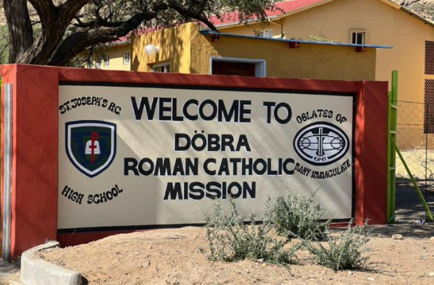

# Hostel Management System

    

St Joseph's RC High School is a high school that houses all its learners in hostels.
One for the boys and another for the girls. As a former learner at this amazing school
I designed this API with my experience in the boy's hostel in mind.  There are
two main actors in the hostel, mainly learners and supervisors or matrons, of which there
are two, one for senior learners (grades 10 - 12) and another for junior learners (grades 9 - 8).
Each grade has their own **block** or dorm, with grades 11 and 12, sharing the same **block**.

## Main API Functionalities

The API was designed to take care of the most common hostel management activities carried out by the supervisors
which are:

- Taking attendance for daily evening study sessions, and afternoon sessions on Sundays
- Taking attendance for lunch and breakfast meals on Saturdays and Sundays
- Taking church attendance on a set weekday for each group of learners and Sundays for all learners
- Assigning and taking attendance for hostel duties to learners

## Additional API Functionalities

- Viewing learner attendance history e.g church attendance history
